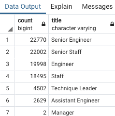

# Pewlett Hackard Analysis

## Project Overview

This project seeks to examine hiring needs for soon-to-retire employees at a large tech company. Specifically, analyzing the employee database provided insights into the number of employees expected to retire and the roles which they hold at the company. Further, identifying experienced employees who are eligible to mentor incoming hires will ease the transition of employee turnover. Overall, this project provides key decision makers with the ability to forecast hiring needs and training resources needed to adjust to the large number of retiring employees. 

## Results

Four key points produced from this analysis are as follows:

1.  When filtering the employee database for the age of retiring employees, it appeared that 133,776 employees were of retirement age.
2.  After further analysis, this number was higher beacause of duplicate titles causing duplicate employee listings. The actual number is 90,398 retirement age employees.
3.  Hiring engineers and staff will be crucial to whethering the wave of upcoming retirements. Figure 1 provides a breakdown of the number of employees at retirement age in each position category.

### Figure 1

4.  1,549 employees are eligible to mentor new hires in their roles. The company will need to enlist more employees to mentor new hires. This would mean decreasing the amount of required experience for mentorship eligibility. 

## Summary

The term "silver tsunami" refers the large amount of people in the baby boomer generation that are retiring or about to retire. The silver tsunami will greatly impact this company, as shown by the amount of employees of retirement age. Specifically, [this table](Data/retirement_info.csv) listd all of the employees who will retire soon and [this table](Data/retirement_emp.csv) shows the break down of retiring employees by department. As mentioned earlier, 90,398 roles will need to be filled when the silver tsunami is over with. 

In order to cope with the silver tsunami and accomodate new hires into this large company, coroporate leadership enacted a mentorship program to help with the large amount of new hires needed. [This table](Data/mentorship_eligible.csv) shows the amount of employees who will be working long enough to mentor new employees as the silver tsunami occurs. Unfortunately, the number of mentor-eligible employees is woefully low compared to how many mentors are necessary for the large amount of hires. As previously mentioned, it is recommended that management give mentor-eligibility to a wider group of employees in order to meet the amount of new hires. Another option would be to start hiring new employees before the silver tsunami occurs to allow the most experienced, close to retirement employees to mentor the new hires. Additionally, a combination of these two methods could prove to be the most cost-effective. In conclusion, it is highly advised that this company prepare for the incoming silver tsunami by planning hiring and mentorship around the massive amount of employees getting ready to retire.
